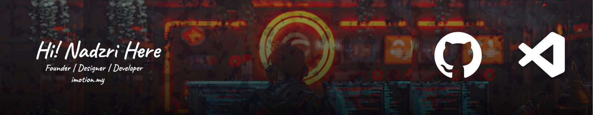

##### Precision in Every Frame, Victory in Every Vision 👋

  
  
  
  
  

  

###

✨ Creating bugs since 2011 📚 I'm currently learning Laravel Framework 🎯 Goals: Bestman for God

###

Learning Code

Learning Design

<picture>
  <source media="(prefers-color-scheme: dark)" srcset="https://raw.githubusercontent.com/nadz87/nadz87/output/pacman-contribution-graph-dark.svg">
  <source media="(prefers-color-scheme: light)" srcset="https://raw.githubusercontent.com/nadz87/nadz87/output/pacman-contribution-graph.svg">
  
</picture>

